# Mailvender backend – architecture

This document describes how the backend is built and why. It's written for
engineers working on the code. For setup and day-to-day use, see
[GETTING_STARTED.md](GETTING_STARTED.md). For operations, see
[RUNBOOK.md](RUNBOOK.md).

Diagrams use [Mermaid](https://mermaid.js.org/). GitHub, GitLab and most
editors render them.

---

## Contents

1. [Context and responsibilities](#1-context-and-responsibilities)
2. [System overview](#2-system-overview)
3. [Code structure and layering](#3-code-structure-and-layering)
4. [Request lifecycle](#4-request-lifecycle)
5. [Identity, sessions and tenancy](#5-identity-sessions-and-tenancy)
6. [Data model](#6-data-model)
7. [Sending pipeline](#7-sending-pipeline)
8. [Domains, DKIM and DNS verification](#8-domains-dkim-and-dns-verification)
9. [Bounces, complaints and suppression](#9-bounces-complaints-and-suppression)
10. [Abuse prevention and account health](#10-abuse-prevention-and-account-health)
11. [Asset hosting](#11-asset-hosting)
12. [Cloud sync](#12-cloud-sync)
13. [Data lifecycle](#13-data-lifecycle)
14. [Worker and scheduled jobs](#14-worker-and-scheduled-jobs)
15. [Cross-cutting concerns](#15-cross-cutting-concerns)
16. [Testing strategy](#16-testing-strategy)
17. [Deployment topology](#17-deployment-topology)
18. [Design decisions](#18-design-decisions)
19. [Known limitations and future work](#19-known-limitations-and-future-work)

---

## 1. Context and responsibilities

Mailvender is a local-first email-template builder (Next.js) with datasets and
mail merge. The backend adds:

| Responsibility                                | Owned by                                      |
| --------------------------------------------- | --------------------------------------------- |
| Editing and rendering email HTML              | **Frontend** (stays in the browser)           |
| Identity, sessions, accounts, roles           | Backend                                       |
| Durable, cross-device storage of work         | Backend (sync) – frontend remains local-first |
| Authorised sending, DKIM, bounces, compliance | Backend + Postfix + OpenDKIM                  |
| Image hosting                                 | Backend + S3/CDN                              |
| Audit, health, data lifecycle                 | Backend                                       |

**Out of scope:** inbound mail and mailboxes (only DSNs to return-path
addresses are accepted), campaign scheduling, analytics, billing,
collaborative editing.

---

## 2. System overview

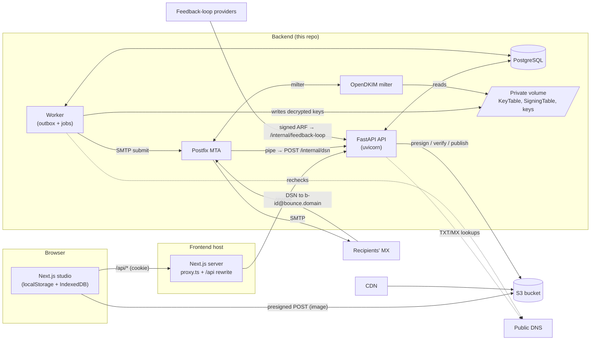

**Local development** replaces S3/CDN with MinIO, delivers all mail to
Mailpit (`POSTFIX_RELAYHOST=[mailpit]:1025`), and runs everything except the
frontend with `docker compose`.

---

## 3. Code structure and layering

```{}
backend/
├── app/
│   ├── main.py                 # app factory, middleware, router registration
│   ├── config.py               # Settings (pydantic-settings, env vars)
│   ├── db.py                   # engine + session factory (UTC connections)
│   ├── models.py               # SQLAlchemy 2 mapped classes (the schema)
│   ├── errors.py               # ApiError hierarchy + the single error shape
│   ├── logging.py              # JSON logs + request/user/account contextvars
│   ├── security.py             # Argon2id, token hashing, Fernet, DKIM keygen, signed tokens
│   ├── pagination.py           # cursor pagination
│   ├── cli.py                  # make-operator, run-job, openapi, dev-verify-domain
│   ├── worker.py               # outbox consumer + scheduler + DKIM key sync
│   ├── api/
│   │   ├── deps.py             # DI: UoW, adapters, auth, account context
│   │   ├── schemas.py          # request/response models (the contract)
│   │   └── routes_*.py         # thin HTTP handlers
│   ├── services/               # application services (business rules)
│   │   ├── common.py           # AccountContext, audit, RateLimiter, email normalisation
│   │   ├── auth.py  accounts.py  domains.py  dns.py
│   │   ├── sending.py  mta.py  feedback.py  health.py
│   │   ├── assets.py  storage.py  sync.py  lifecycle.py
│   └── repositories/
│       ├── interfaces.py       # Protocols + UnitOfWork
│       └── sql.py              # SQLAlchemy implementations (the only persistence code)
├── alembic/                    # migrations (0001 = initial schema + trigger + sequence)
├── tests/                      # pytest against real Postgres, fakes for S3/DNS/SMTP
├── openapi.json                # published contract (CI-checked)
├── Dockerfile  scripts/entrypoint.sh
```

### Layers

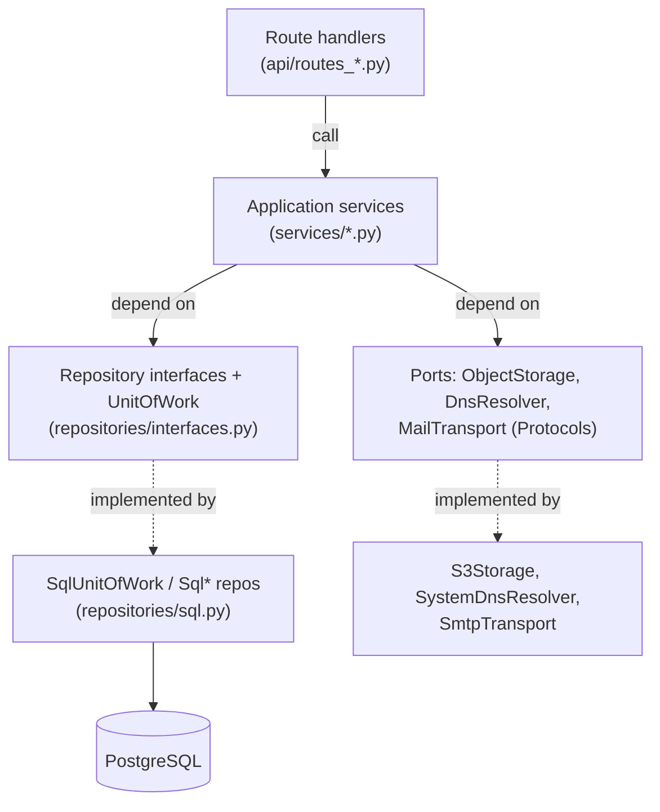

Rules:

- **Route handlers** parse HTTP input, resolve auth through dependencies, call
  one service method and map the result to a response schema. No business
  logic.
- **Services** hold the rules (permissions beyond role checks, validation,
  state transitions, audit). They receive a `UnitOfWork` and adapters. They
  never import SQLAlchemy and never see a `Session`.
- **Repositories** (in `sql.py`) are the only code that builds queries. Each
  method maps to an intention (`count_recipients_since`, `claim`,
  `suppressed_among`) rather than generic CRUD.
- **Unit of work.** Services call `uow.commit()` at the end of a use case. Any
  exception before that leaves the transaction uncommitted, and the session
  closes, which rolls it back. Entities returned by repositories are SQLAlchemy
  objects whose changes are persisted by the commit (a pragmatic Unit of Work
  rather than a full domain/persistence split).
- **Ports for infrastructure** (`ObjectStorage`, `DnsResolver`,
  `MailTransport`) are `Protocol`s, swapped for in-memory fakes in tests via
  FastAPI `dependency_overrides` and the worker constructor.

---

## 4. Request lifecycle

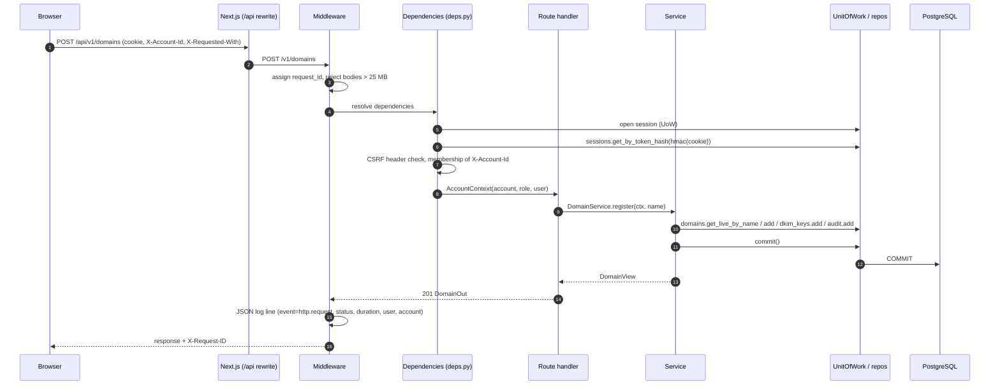

Errors raised anywhere (`ApiError` subclasses, validation errors, unexpected
exceptions) are converted by handlers in `errors.py` to one shape:

```json
{"error": {"code": "…", "message": "…", "fields": [{"field","code","message"}], "details": {}, "request_id": "…"}}
```

---

## 5. Identity, sessions and tenancy

### Authentication

| Mechanism                                            | Used by                  | Details                                                                                                                                                                                 |
| ---------------------------------------------------- | ------------------------ | --------------------------------------------------------------------------------------------------------------------------------------------------------------------------------------- |
| Session cookie `mv_session`                          | Browsers                 | 256-bit random token. Only `HMAC-SHA256(SECRET_KEY, token)` is stored. `HttpOnly`, `Secure`, `SameSite=Lax`, 14-day expiry, revocable. Checked on every request (immediate revocation). |
| API key `Authorization: Bearer mv_<lookup>_<secret>` | Servers                  | Per account, keyed hash stored, plaintext shown once. Accepted only on endpoints using the `CtxOrKey` dependency (send, read messages, domains, senders, suppressions).                 |
| `X-Internal-Token`                                   | Postfix DSN pipe         | Shared secret, constant-time compare.                                                                                                                                                   |
| `X-Mailvender-Signature`                             | Feedback-loop sources    | `sha256=HMAC(body, per-source secret)`.                                                                                                                                                 |
| Signed recipient tokens                              | Unsubscribe / view links | Fernet (AES-CBC + HMAC with timestamp). Opaque, tamper-proof, expire after 90 days.                                                                                                     |

**CSRF:** cookie-authenticated unsafe requests must carry
`X-Requested-With: mailvender`. A cross-site HTML form can't set custom
headers, and cross-site `fetch` with one triggers a CORS preflight the API
rejects for unknown origins. Login and signup require the header too.

### Signup and verification

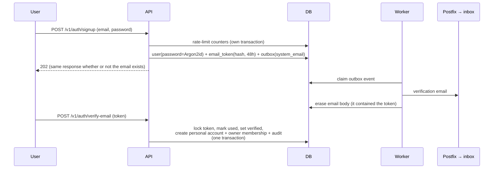

Password reset follows the same pattern (single-use, 60 minutes, revokes all
sessions). Neither signup nor reset reveals whether an address is registered.

### Tenancy

- Every account-owned table has `account_id`. The active account comes from
  the **authenticated context**: `X-Account-Id` (checked against
  `memberships`) for sessions, or the key's account for API keys. A body field
  is never trusted (there's a test for this).
- Repositories take `account_id` for every account-scoped read
  (`get(id, account_id)`). Another account's resource is indistinguishable
  from a missing one (**404**). Selecting an account you're not a member of is
  **403** `not_a_member`.
- Roles: `owner` and `member`. Owner-only actions: invitations, removing
  members, ownership transfer, API keys, sender identities, export, deletion.
  The last owner can't leave or be removed (409 `last_owner`).
- **Operators** are users with `is_operator` (set via CLI). They use
  `/v1/operator/*` and are not account members.

---

## 6. Data model

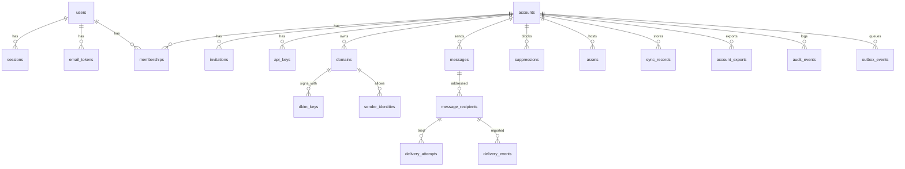

| Table                                                 | Notes                                                                                                                                                     |
| ----------------------------------------------------- | --------------------------------------------------------------------------------------------------------------------------------------------------------- |
| `users`                                               | Email unique (normalised lowercase). `default_account_id` = personal account.                                                                             |
| `accounts`                                            | `kind` personal/team, `status` active/deleted, sending limits, suspension fields, postal address.                                                         |
| `memberships`                                         | Unique (account, user), role.                                                                                                                             |
| `sessions`, `email_tokens`, `invitations`, `api_keys` | Hashes only; expiry/revocation timestamps.                                                                                                                |
| `domains`                                             | Unique **live** name (partial unique index where `disabled_at IS NULL`), so a deleted account frees the name. `record_status` JSON caches the last check. |
| `dkim_keys`                                           | Fernet-encrypted PKCS#8 private key, base64 SPKI public key, status pending/active/retired.                                                               |
| `sender_identities`                                   | Unique (account, email), status pending/verified/disabled.                                                                                                |
| `messages`                                            | Unique (account, idempotency_key) plus `request_hash` for replay detection.                                                                               |
| `message_recipients`                                  | One per recipient: status, attempts, timestamps. Indexed (account, created_at) for limits and health.                                                     |
| `outbox_events`                                       | Transactional outbox, indexed (status, available_at).                                                                                                     |
| `delivery_attempts` / `delivery_events`               | MTA hand-off attempts / post-delivery bounces and complaints.                                                                                             |
| `suppressions`                                        | Unique (account, email), reason and source.                                                                                                               |
| `sync_records`                                        | PK (account, collection, id), `revision`, `deleted`, `seq` (global sequence `sync_seq`), `parent_id` (versions → page).                                   |
| `audit_events`                                        | **Immutable**: a `BEFORE UPDATE OR DELETE` trigger raises.                                                                                                |
| `rate_limit_counters`                                 | PK (key, window_start).                                                                                                                                   |
| `job_runs`                                            | Last run/error per scheduled job.                                                                                                                         |

All ids are UUIDs (v4 server-side; the frontend derives v5 UUIDs for synced
records). All timestamps are `timestamptz`, and connections use `timezone=utc`.

Migrations are Alembic. `0001_initial_schema` creates all tables, the
`sync_seq` sequence and the audit trigger. A test asserts that the migrated
schema equals the models (`compare_metadata == []`) and that downgrade and
upgrade round-trip.

---

## 7. Sending pipeline

### Accepting a send

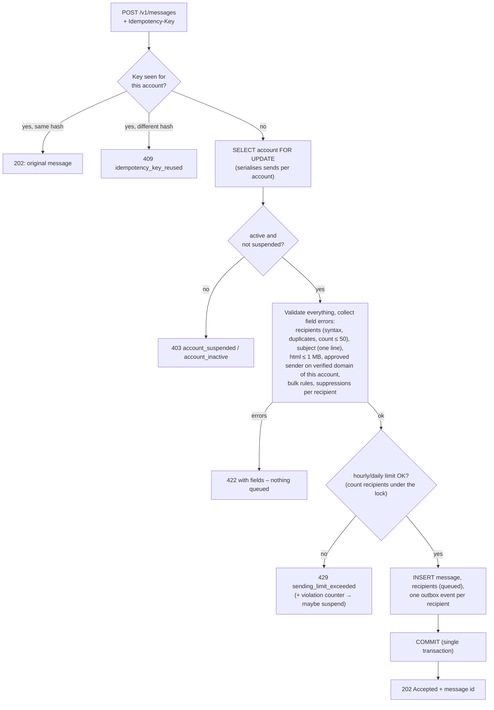

**Bulk rules** (`category=bulk`): a usable text part; `{{unsubscribe_url}}`
in the HTML; the account's postal address set and present (literally or as
`{{physical_address}}`); the domain `bulk_eligible` (DMARC present, SPF
alignment relaxed).

### Delivering

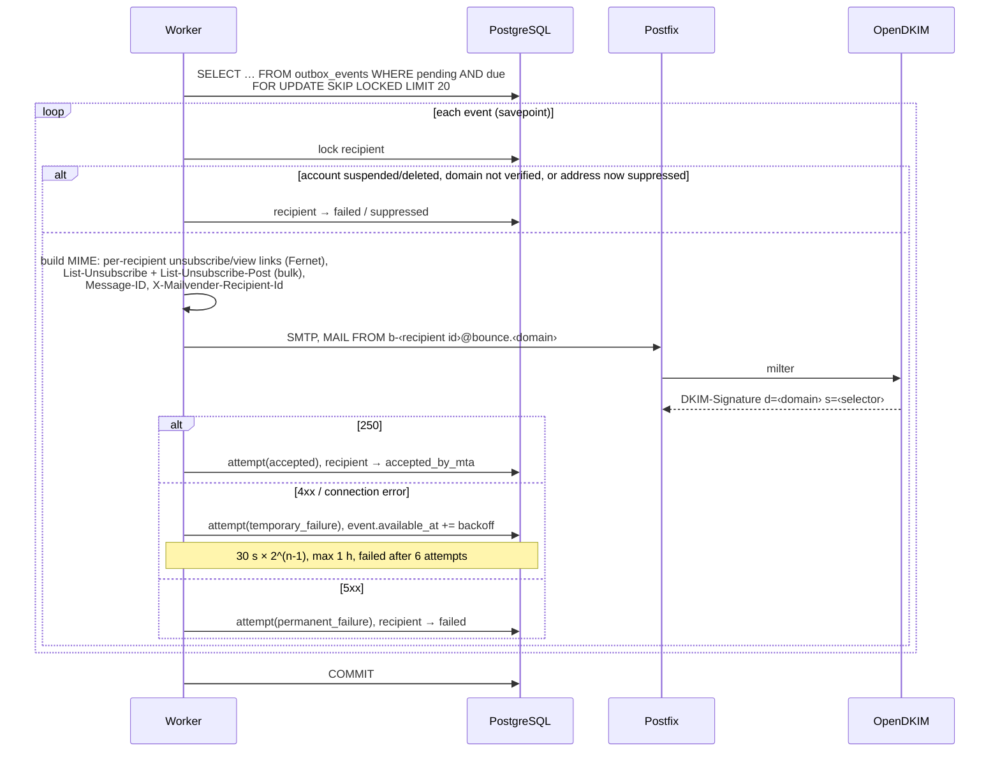

Recipient states:

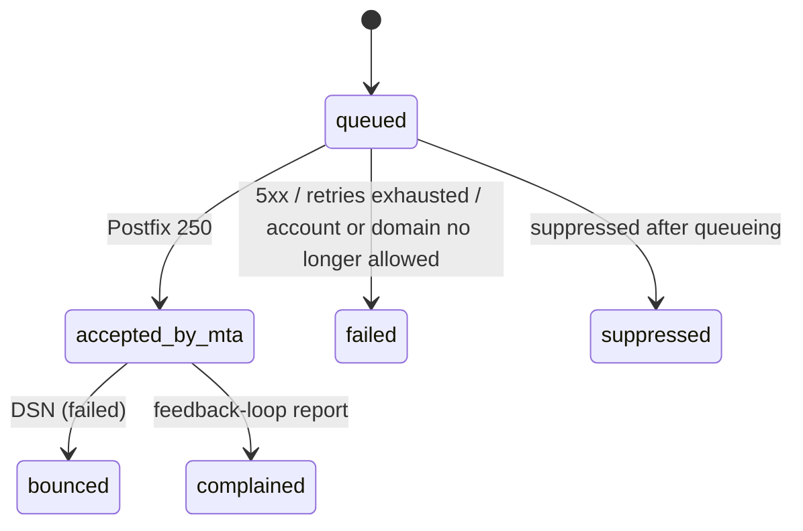

Delivery is **at least once**: if the worker crashes after Postfix accepted
but before the commit, the message is resent. That trade-off is accepted
rather than risking lost mail.

---

## 8. Domains, DKIM and DNS verification

On registration the API normalises the name (IDNA, label checks) and enforces
global uniqueness among live domains without revealing the owning account
(`409 domain_unavailable`). It generates a **2048-bit RSA key**, stores the
private key Fernet-encrypted, and creates a unique selector (`mvYYYYMM…`).

Required records (`DomainService.expected_records`):

| Key              | Type | Name                                 | Value                                      | Required |
| ---------------- | ---- | ------------------------------------ | ------------------------------------------ | -------- |
| `dkim`           | TXT  | `<selector>._domainkey.<domain>`     | `v=DKIM1; k=rsa; p=…`                      | yes      |
| `return_path_mx` | MX   | `bounce.<domain>`                    | `10 <RETURN_PATH_MX_HOST>`                 | yes      |
| `spf`            | TXT  | `bounce.<domain>`                    | `v=spf1 include:<SPF_INCLUDE_DOMAIN> -all` | yes      |
| `dmarc`          | TXT  | `_dmarc.<domain>`                    | `v=DMARC1; p=none; …; adkim=r; aspf=r`     | for bulk |
| `dkim_next`      | TXT  | `<new selector>._domainkey.<domain>` | during rotation                            | no       |

Each record is reported `verified`, `missing` or `mismatched`. Lookup failures
count as missing, so a DNS outage never verifies a domain.

**Alignment:** DKIM signs with `d=<domain>`, which always aligns with the From
domain. SPF is evaluated on the envelope sender `bounce.<domain>`, which
aligns under **relaxed** alignment. A DMARC record with `aspf=s` makes the
domain not bulk-eligible, and the API says why.

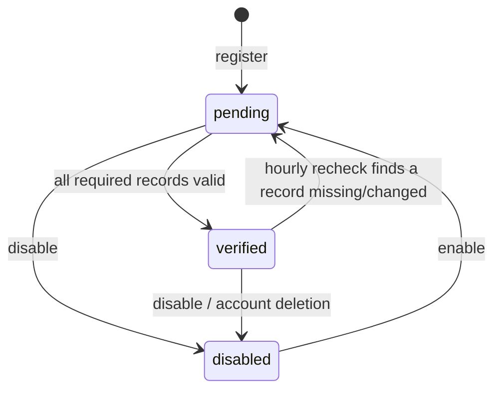

**Key distribution to OpenDKIM.** The worker's `dkim_key_sync` job (every
30 s) decrypts active keys onto a private volume shared only with OpenDKIM
(`keys/<selector>.private`, `KeyTable`, `SigningTable` written atomically) and
bumps a `generation` file. OpenDKIM's entrypoint watches it and sends
`SIGUSR1` to reload. **Rotation:** a pending key is published as `dkim_next`;
when its record verifies it becomes active and the old key is retired, then
deleted after 30 days.

**Sender identities** are exact addresses on a domain, created and approved by
owners. A send needs `identity.status == verified` **and**
`domain.status == verified`, so losing DNS stops sends immediately without
touching identities.

---

## 9. Bounces, complaints and suppression

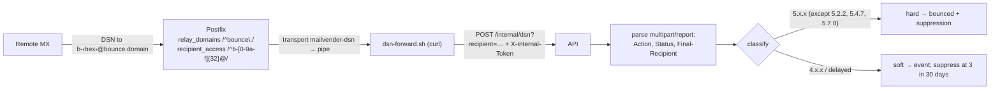

- **Correlation** prefers the VERP envelope recipient
  (`b-<recipient uuid hex>`) and falls back to `X-Mailvender-Recipient-Id`
  in the returned headers.
- **Complaints** (ARF) arrive at `/internal/feedback-loop/{source}`, signed
  per source. They're correlated by the original's
  `X-Mailvender-Recipient-Id`, mark the recipient `complained`, and suppress
  immediately.
- **Unsubscribe**: `GET /u/{token}` shows a confirmation form (link scanners
  prefetch GETs, so a GET never unsubscribes). `POST /u/{token}` (RFC 8058
  one-click, or the form) records the suppression **idempotently** (unique
  constraint plus savepoint).
- Every suppression, bounce classification and complaint writes an
  `audit_events` row. Only `manual` suppressions can be removed.
- Suppressions are checked **at acceptance** (field error per recipient,
  deliberately vague: "can't receive email from this account") **and again at
  delivery**.

---

## 10. Abuse prevention and account health

- **Limits.** `hourly_recipient_limit` / `daily_recipient_limit` per account
  (defaults 100/500). Enforced atomically: the send path locks the account row
  (`SELECT … FOR UPDATE`) before counting recipients in the window, so
  concurrent requests serialise per account. A test fires 10 concurrent sends
  at a limit of 5 and expects exactly 5 accepted.
- **Violations.** Each over-limit attempt increments a per-hour counter. At
  `LIMIT_VIOLATIONS_BEFORE_SUSPENSION` (20) the account is suspended.
- **Health job** (every 5 min): over `HEALTH_WINDOW_DAYS` (7), bounce rate =
  hard bounces / accepted and complaint rate = complaints / accepted. It acts
  only when at least `HEALTH_MIN_VOLUME` (100) were accepted. Thresholds are 5%
  and 0.1%.
- **Suspension** blocks new sends (403 `account_suspended`) and fails queued
  recipients at delivery. Login, sync and export keep working.
- **Operator API** lists metrics, limits, state and the latest decision, and
  suspends, reinstates, changes limits or records reviews. Every action is an
  immutable audit row with actor and reason.

---

## 11. Asset hosting

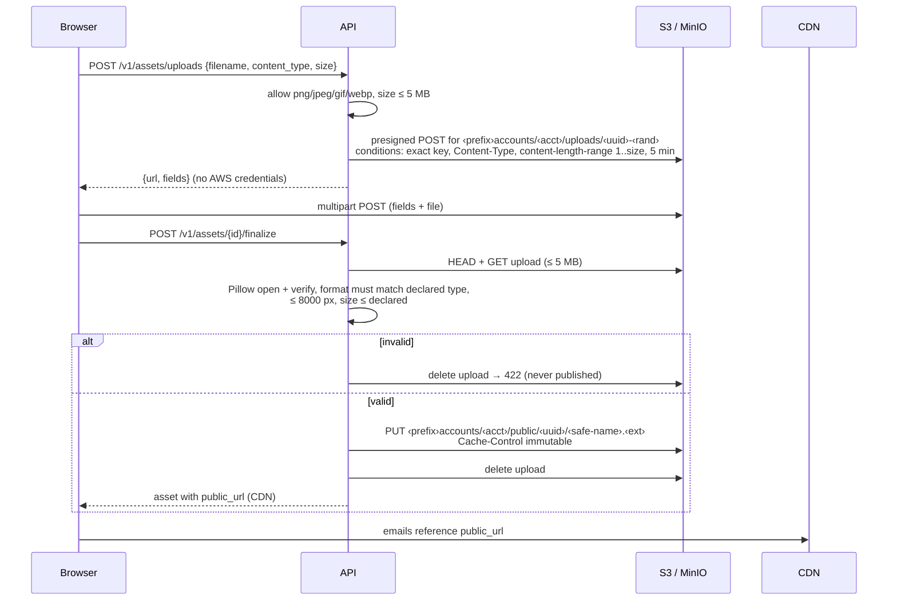

- The bucket policy allows anonymous `GetObject` **only** on
  `accounts/*/public/*`. Uploads and unfinalized objects stay private (the E2E
  check confirms 403).
- Keys are unguessable (random UUIDs) and segregated by account prefix.
- Delete removes the public object. Emails already delivered keep whatever the
  client cached. CDN invalidation is an operational step.
- `AWS_S3_UPLOAD_ENDPOINT_URL` exists only so local presigned URLs point at
  `localhost:9000` instead of `minio:9000`. A presigned POST's signature
  doesn't cover the host.

---

## 12. Cloud sync

### Server contract

- Generic records: `(account_id, collection, id)` with `data` (JSON),
  `revision`, `deleted`, `seq`, `parent_id`, `updated_at`/`by`.
- Collections: `pages`, `workspace` (page order), `saved_pages`,
  `components`, `brand`, `datasets`, `versions` (`parent_id` = page).
- `PUT` / `DELETE` take `expected_revision` (0 = create). A mismatch returns
  `409 revision_conflict` with `details.current`, and nothing is overwritten.
- `seq` comes from a global sequence, assigned while holding a per-account
  advisory lock (`pg_advisory_xact_lock`). Within an account, `seq` therefore
  commits in order, and `GET /v1/sync/changes?since=` can't skip a change.
- `GET /v1/sync/snapshot` pages live records and returns a `watermark` (max
  seq at the first page). A new device fetches the snapshot, then changes
  since the watermark.
- `POST /v1/pages/{id}/versions/{vid}/restore` first saves the current page as
  a version, then writes the restored doc as a new revision.

### Client engine (`mailvender/lib/sync`)

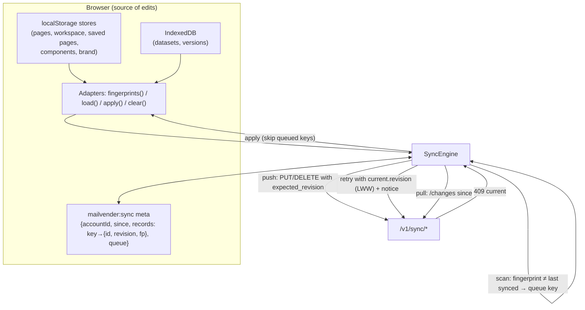

Key choices:

- **Local first.** Every edit writes locally (synchronously for
  localStorage), and the editor never awaits the network. The queue stores
  only keys, and data is re-read at push time, so large datasets never land in
  localStorage.
- **Change detection by fingerprint** (cyrb53 of the JSON, or `updatedAt` for
  datasets) instead of instrumenting every mutation. Existing stores stay
  untouched apart from small sync hooks.
- **Deterministic ids.** Server ids are UUIDv5(`collection:localId`), so local
  ids (`page_x1y2`) stay unchanged and every device derives the same UUID
  without a mapping table.
- **Conflict policy (documented in the OpenAPI descriptions).** A queued local
  change that hits 409 is retried against the current revision (last write
  wins, the user's offline change being the last write), with a non-blocking
  notice. Remote changes for keys still in the queue aren't applied; the push
  decides.
- **First sign-in in a browser adopts local data** (made before sync existed):
  server records are applied first, local-only ones uploaded, and the blank
  "Page 1" of a fresh browser is dropped when the account already has pages.
  **Switching accounts** refuses while the queue isn't empty, then clears and
  re-hydrates. **Sign-out** clears local data (privacy on shared machines).
- The open page is reloaded in the editor when another device replaces it
  (`onPageReplaced`).
- `DatasetsProvider` receives a **local-first `DatasetRepository`**
  (`lib/datasets.ts`) that delegates to IndexedDB and asks the engine to
  upload. Autosave and undo/redo are unchanged.

---

## 13. Data lifecycle

- **Export:** owner requests it, the worker builds a ZIP of JSON (workspace
  records, members, domains, identities, asset metadata, message metadata
  without bodies, suppressions) into private storage. Download is owner-only,
  expires after 24 h, and is audited.
- **Deletion:** one transaction marks the account deleted, revokes its API
  keys and its members' sessions, disables domains (freeing names) and
  identities, fails queued recipients and cancels their outbox events,
  removes memberships, and queues asset deletion. Workspace data is purged
  after 30 days. Suppressions and audit are retained.
- **Retention job** (daily): purge bodies at 30 days, messages at 90,
  delivery events at 180, expired tokens/sessions/counters/exports, retired
  DKIM keys at 30, abandoned uploads after 1 h. See
  [RETENTION.md](RETENTION.md).

---

## 14. Worker and scheduled jobs

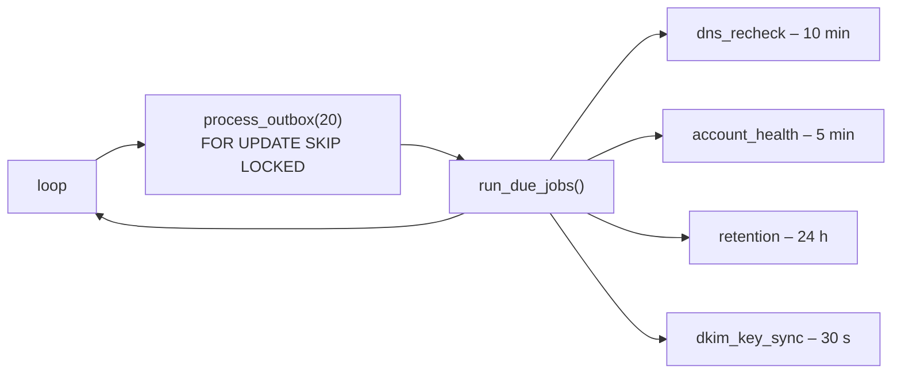

| Outbox kind             | Handler                                                       |
| ----------------------- | ------------------------------------------------------------- |
| `deliver_recipient`     | `DeliveryService.deliver` (retry/backoff inside)              |
| `system_email`          | Verification/reset/invitation mail, body erased after sending |
| `account_export`        | `LifecycleService.build_export`                               |
| `account_assets_delete` | Delete an account's assets                                    |

- Each event runs in a **savepoint**. An unexpected exception backs off
  (30 s × 2ⁿ) and dead-letters after 10 attempts (`outbox.dead_letter` log).
- Jobs take `pg_try_advisory_xact_lock(job name)`, so any number of workers can
  run without double execution. Results are recorded in `job_runs`.
- `SKIP LOCKED` lets several workers share the outbox safely.
- Graceful stop on SIGTERM/SIGINT. The worker waits for migrations to reach
  head before starting.

---

## 15. Cross-cutting concerns

| Concern              | Implementation                                                                                                                                                                                                                                                                             |
| -------------------- | ------------------------------------------------------------------------------------------------------------------------------------------------------------------------------------------------------------------------------------------------------------------------------------------ |
| **Errors**           | One JSON shape; stable `code`; user-safe `message`; `fields` for validation (`to[2]`, `X-Account-Id`, …). Documented responses on every route.                                                                                                                                             |
| **Pagination**       | Keyset on `(created_at, id)`, opaque base64 cursor, default 25, max 100 (422 above). Sync snapshot uses `(collection, id)` plus watermark.                                                                                                                                                 |
| **Logging**          | JSON to stdout: `time, level, logger, event, request_id, user_id, account_id` + fields (`message_id`, …). `X-Request-ID` echoed. Health probes aren't logged.                                                                                                                              |
| **Rate limiting**    | Fixed windows in `rate_limit_counters` via `INSERT … ON CONFLICT DO UPDATE … RETURNING`, committed in its **own** transaction so failed attempts still count. Per IP and per email for signup, login, verification resend and reset. 429 with `Retry-After`; `rate_limit.exceeded` logged. |
| **Secrets**          | Env vars only. Argon2id for passwords. HMAC for tokens and keys. Fernet for DKIM keys and recipient tokens. Nothing secret is returned by the API (export excludes keys).                                                                                                                  |
| **Contract**         | FastAPI generates `/openapi.json`, committed as `backend/openapi.json` (CI diff). The frontend generates `lib/api/schema.d.ts` with `openapi-typescript` and calls the API through typed `openapi-fetch`. No handwritten duplicate types.                                                  |
| **Timestamps / ids** | UTC `timestamptz`, ISO 8601 with offset; UUIDs everywhere.                                                                                                                                                                                                                                 |
| **Migrations**       | Alembic. The API entrypoint runs `upgrade head` under an advisory lock before serving.                                                                                                                                                                                                     |
| **Security headers** | `X-Content-Type-Options`, `Referrer-Policy`; view-in-browser served with a script-blocking CSP.                                                                                                                                                                                            |

---

## 16. Testing strategy

- **pytest against real PostgreSQL** (`TEST_DATABASE_URL`). The session fixture
  drops the schema and runs Alembic (testing migrations). Each test truncates
  all tables afterwards.
- **Fakes** for `ObjectStorage`, `DnsResolver` and `MailTransport` go through
  the same interfaces as production.
- Coverage: migrations (round-trip, models = schema, audit immutability),
  auth (hashing, verification, cookies, revocation, expiry, reset, CSRF, rate
  limits), accounts and roles, **cross-account isolation** (reads, writes,
  sends, API keys, domains, body-supplied account ids), domains and DNS
  states and rotation, sending (queueing, MIME, idempotency, validation,
  retries, permanent failures, concurrency limits, suspension, API keys),
  feedback (unsubscribe, hard/soft bounces, complaints, signatures), health
  and operator, assets, sync (conflicts, tombstones, snapshot and changes,
  versions), lifecycle (export, deletion, retention).
- A manual **end-to-end** pass through the real stack (Next.js proxy →
  API → worker → Postfix + OpenDKIM → Mailpit, DSN back through Postfix,
  MinIO policy) verified the infrastructure wiring.

---

## 17. Deployment topology

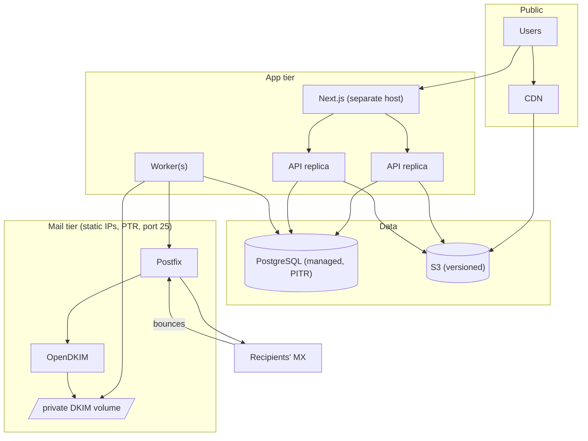

API replicas are stateless (sessions live in Postgres). Workers scale
horizontally. Postfix needs stable outbound IPs with reverse DNS, and
`POSTFIX_MYNETWORKS` limited to worker addresses. In the compose file the mail
network has fixed addresses for exactly this reason.

---

## 18. Design decisions

| Decision                                                                            | Why                                                                                                                                                 | Trade-off / alternative                                                                                       |
| ----------------------------------------------------------------------------------- | --------------------------------------------------------------------------------------------------------------------------------------------------- | ------------------------------------------------------------------------------------------------------------- |
| **FastAPI + Pydantic + SQLAlchemy 2 + Alembic + Postgres** (given)                  | Typed contracts and automatic OpenAPI; a mature ORM and migrations; Postgres gives transactions, `SKIP LOCKED`, advisory locks, JSONB.              | —                                                                                                             |
| **Repository + Unit of Work, sync (not async) SQLAlchemy**                          | Required layering. Services stay testable and persistence-agnostic. Sync code is simpler and FastAPI runs sync endpoints in a thread pool.          | Async would raise per-process concurrency. Revisit if the API becomes I/O-bound at scale.                     |
| **Postgres for everything (outbox, rate limits, locks, sync seq)**                  | One dependency to operate. Every state change commits atomically with its side effects.                                                             | Redis/Kafka would scale higher. Not needed at this stage.                                                     |
| **Transactional outbox + worker**                                                   | "202 after durable queueing" with no lost or orphaned messages. Retries and backoff are explicit.                                                   | At-least-once delivery (rare duplicates on crash).                                                            |
| **One SMTP message per recipient**                                                  | Per-recipient unsubscribe tokens, VERP bounce correlation, individual status.                                                                       | More SMTP transactions than BCC batches. The frontend's batch mode still sends one copy per recipient.        |
| **Postfix + OpenDKIM milter** (given)                                               | Mature and observable. The API owns authorisation, the MTA only relays. `milter_default_action = tempfail` means mail is never sent unsigned.       | Signing in Python (dkimpy) would remove a moving part but contradicts the requirement.                        |
| **DKIM keys encrypted in the DB, decrypted to a private volume**                    | One source of truth, at-rest encryption, rotation through the API. OpenDKIM reads plain files and reloads on SIGUSR1.                               | The volume holds plaintext keys: restrict it to the worker and OpenDKIM. A KMS/HSM could replace Fernet.      |
| **VERP return path `b-<id>@bounce.<domain>`**                                       | Exact bounce-to-recipient correlation even when DSNs are malformed. SPF aligns relaxed with the From domain.                                        | Requires the customer to publish MX + SPF on `bounce.`.                                                       |
| **Session cookies (not JWT)**                                                       | Instant revocation (AC: revoked sessions rejected immediately), no token in JS or localStorage.                                                     | A DB lookup per request (indexed, cheap).                                                                     |
| **Keyed HMAC for tokens and API keys, Argon2id for passwords**                      | High-entropy secrets don't need slow hashing, and HMAC allows indexed lookup. Passwords do need it.                                                 | Rotating `SECRET_KEY` invalidates keys and links (documented).                                                |
| **CSRF via custom header + SameSite=Lax**                                           | Simple, stateless, works with the same-origin proxy.                                                                                                | Requires every client to send the header (the typed client does it centrally).                                |
| **Same-origin `/api` proxy through Next.js**                                        | First-party cookies, no CORS in the browser, API not exposed separately.                                                                            | An extra hop. Body size limits of the proxy apply (datasets ≤ 25 MB).                                         |
| **404 for other accounts' resources; vague suppression and domain-conflict errors** | No cross-tenant information leaks.                                                                                                                  | Slightly less helpful errors.                                                                                 |
| **Atomic limits via account row lock**                                              | Correct under concurrency with no extra infrastructure.                                                                                             | Serialises sends within one account (fine at these volumes).                                                  |
| **Fernet for recipient tokens**                                                     | Opaque (encrypted), signed and expiring in one primitive.                                                                                           | Long tokens (≈200 chars); MIME uses a 998-character line policy so `List-Unsubscribe` isn't RFC 2047-encoded. |
| **Presigned POST + server-side verification for images**                            | No AWS credentials in browsers. Size and type enforced by S3 _and_ re-verified by decoding the image before publishing. SVG excluded (script risk). | The API downloads each image once on finalize.                                                                |
| **Generic sync records + revisions + change feed**                                  | One endpoint family for all collections. Optimistic concurrency without locks. Tombstones propagate deletions.                                      | Whole-record LWW, not field-level merging (documented policy). Large datasets are uploaded whole.             |
| **Fingerprint scanning on the client**                                              | Minimal intrusion into existing editor stores. Robust to any mutation path.                                                                         | Periodic re-hashing of local data (cheap at these sizes).                                                     |
| **Immutable audit via DB trigger**                                                  | Guaranteed even against application bugs or manual SQL.                                                                                             | Corrections must be new rows.                                                                                 |
| **Community MinIO images (`pgsty/*`)**                                              | Official images are no longer distributed. Local only.                                                                                              | Revisit if a maintained official image returns.                                                               |
| **`cryptography<47` pin**                                                           | Newer wheels crash (SIGILL) on some older Docker VMs on Apple Silicon.                                                                              | Remove once all developer Docker installs are current.                                                        |

---

## 19. Known limitations and future work

- Feedback loops must POST signed reports. Providers that only email ARF
  reports need a small signing relay (or an inbound address routed like DSNs).
- Sync conflict resolution is whole-record last-write-wins. Collaborative
  editing would need operational transforms or CRDTs.
- `dev-verify-domain` exists because local domains can't publish DNS. It's
  refused outside `ENVIRONMENT=development`.
- The frontend sync engine is verified manually and through the backend
  contract tests. It has no automated browser tests yet.
- Health metrics are computed per request for the operator list. Materialise
  them if the number of accounts grows large.
- Out of scope by design: scheduling, A/B tests, open/click analytics,
  billing, inbound mailboxes.
